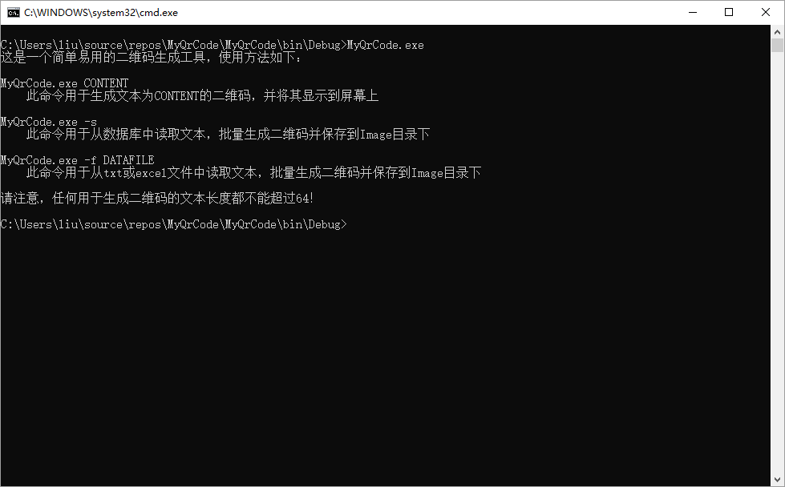
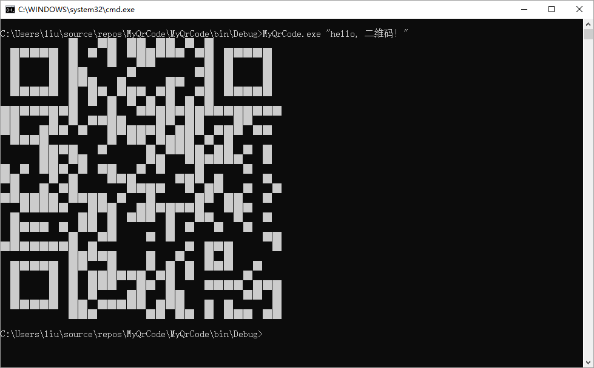
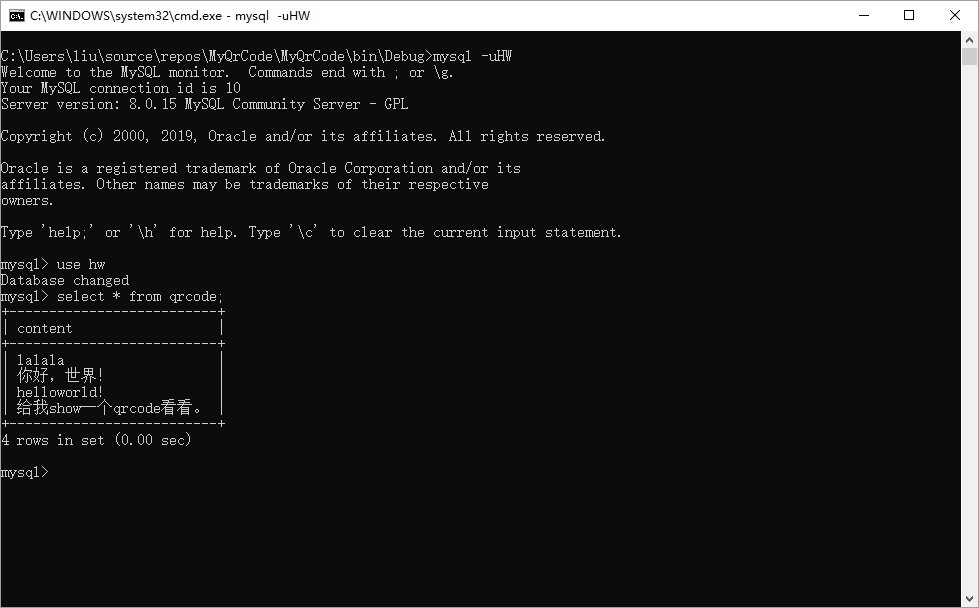
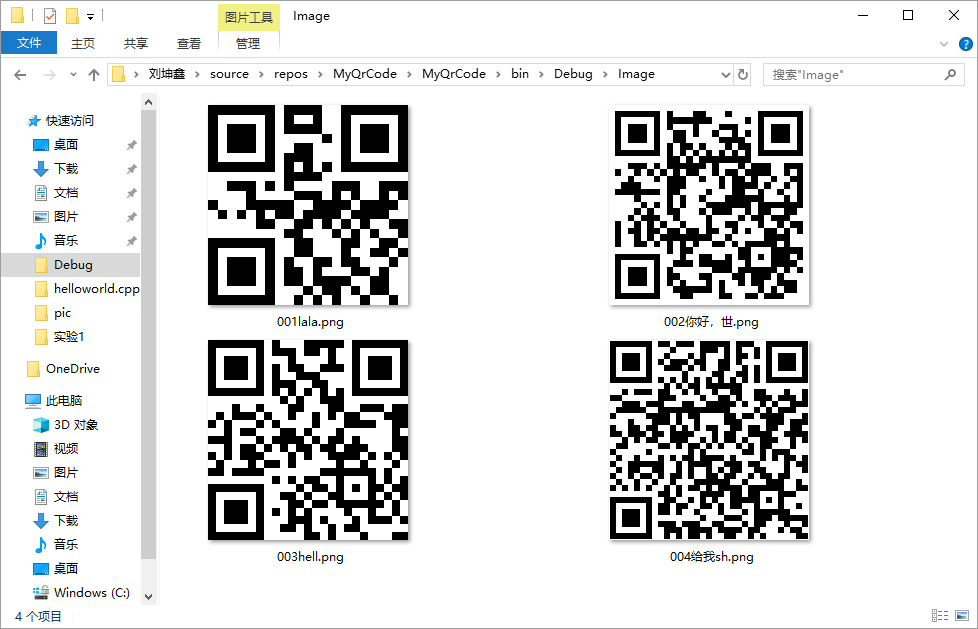
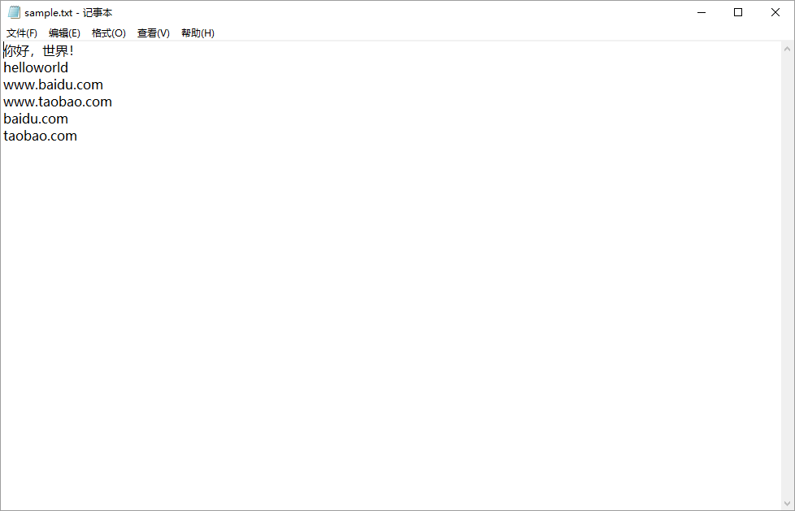
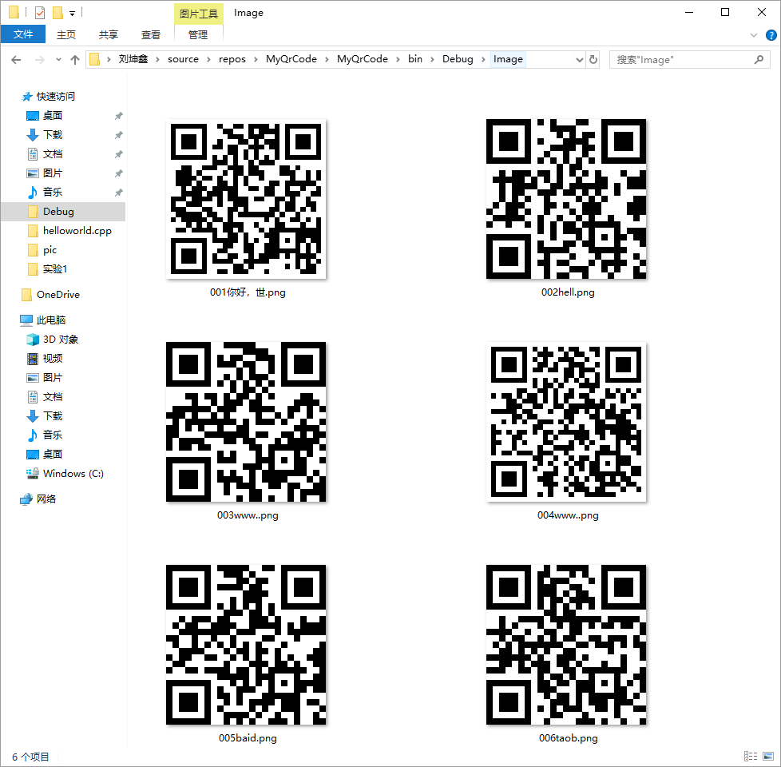
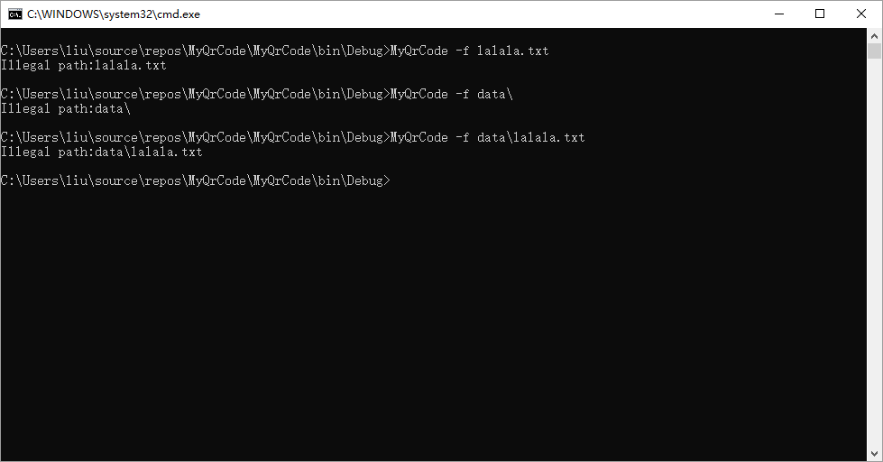
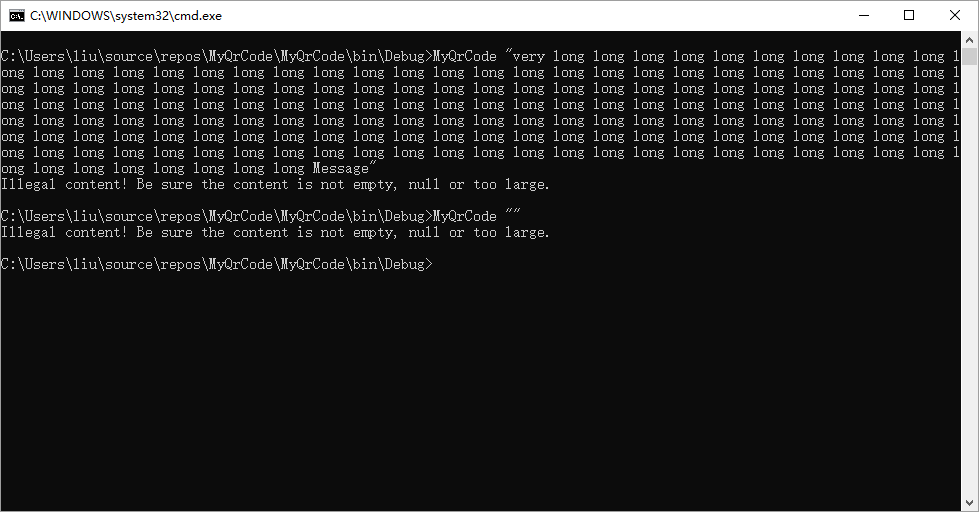
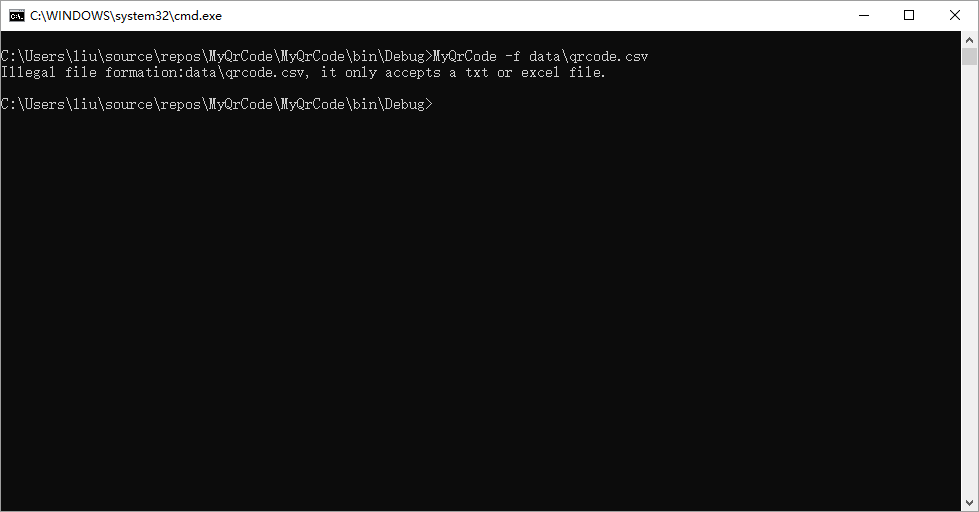
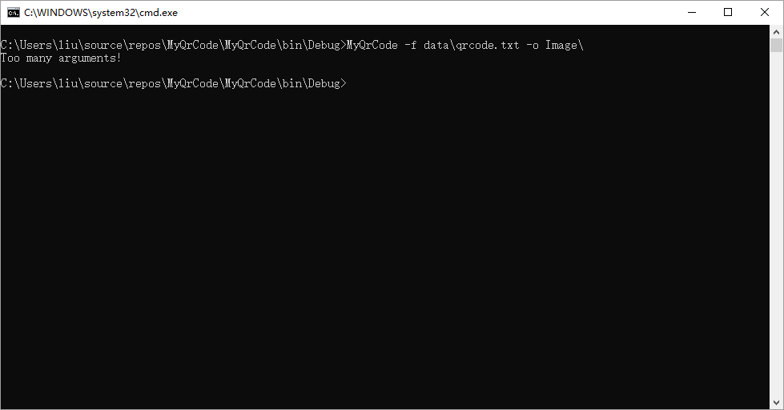

This is an easy-to-use qrcode generator.

这是一款简单易用的二维码生成器。

<!-- TOC -->

- [**一、功能概述**](#一功能概述)
- [**二、项目特色**](#二项目特色)
- [**三、代码总量**](#三代码总量)
- [**四、工作时间**](#四工作时间)
- [**五、知识点总结图（Concept MAP）**](#五知识点总结图concept-map)
- [**六、结论**](#六结论)
    - [实验过程](#实验过程)
    - [实验结果](#实验结果)

<!-- /TOC -->

（我尝试了html和css的语法，都未能修改在github网页上显示的字体。路径下readme.pdf是我在本地预览的样子。）

下面是实验报告
============

<h1 style="font-family:SimHei;font-size:29px;text-align:center">
《C#控制台编程》实验报告
</h1>
<h2 style="font-family:SimSun;font-size:21px;text-align:center">
学院：智能与计算学部 班级：1班<br/>
学号：3017218061 姓名：刘坤鑫<br/>
日期：2019年3月19日
</h2>

### **一、功能概述**



- 实现了实验的所有要求。
- 更详细的功能介绍，参考[实验结果](#实验结果)。
- **最详细的功能介绍，都写在注释里了。**

### **二、项目特色**

1. 工程化代码：规范命名，异常处理，权限处理，简洁的函数，必要的注释，多文件编程释等等。
2. 解决了Windows下txt记事本文件编码乱码问题，可以识别 ```gbk``` ，```utf8``` ，```utf8带BOM``` 三种编码格式的txt文件。

### **三、代码总量**

| 文件名 | 代码量 |
| :--- | ---: |
| EncodingType.cs | 105 |
| QrCodeSolution.cs | 244 |
| MyQrCode.cs | 61 |
| total | 410 |
| readme | 150+ |
| report | 19P |

### **四、工作时间**

五天

### **五、知识点总结图（Concept MAP）**


### **六、结论**

#### 实验过程

整个实验过程中可谓一波三折，疲惫时感觉心力交瘁，完成时感觉意犹未尽。整个实验过程可以归结为百度谷歌不断学习不断DEBUG的过程。

以下稍微例举一下遇到的困难：

1. 将二维码打印到黑窗口中由于字符不对手机不能识别。
2. 保存二维码时候因为没有添加对应的引用一直找不到命名空间。
3. 读取txt文件中文乱码。
4. 读取excel文件时不能读取相对路径。
4. 尝试根据文件二进制信息识别文件类型，不过放弃了，因为网上代码不一致。
5. 数据库操作都是现学现卖。。
7. 修改github上markdown字体未遂

由于时间关系并且实验没有要求，一些其他的拓展并没有实现：

1. -o 参数，指定保存路径并且可以定制化文件命名格式。还有行号显示不应该只是固定的三位数，应该根据合法的文本数量自动变化。
2. --logo 参数，二维码内嵌图片。
3. --delimiter，用户可以指定文本的界定符。
4. excel和mysql指定读取哪些内容。

#### 实验结果

用户仅输入

``` shell
> MyQrCode
```

显示使用说明：


用户输入文本：

``` shell
> MyQrCode CONTENT
```

显示由CONTENT生成的二维码到命令行中：



先在本地数据库中设置新用户 ```HW``` ，密码为空，创建数据库 ```hw``` ，创建表格 ```qecode``` ，在 ```content``` 列中插入要生成二维码的文本内容：



用户输入：

``` shell
> MyQrCode -s
```

将从数据库中读入的文本内容生成二维码并保存到 ```Image``` 路径下：



注意，考虑到**本程序的目的只是一款简单易用的二维码生成器**，读取数据库只能在上述指定的用户、密码、数据库、表格、列中读取。

如果用户需要读取指定的数据库，在源码中的mysql连接指令中修改即可。

在程序所在路径下创建 ```Windows``` 文本文件 ```sample.txt``` 写入内容：



用户键入：

``` shell
> MyQrCode -f sample.txt
```

程序将逐行读取文本文件中文本内容，将生成的二维码依次保存到 ```Image``` 目录下，并且命名格式为三位数的行号+文本信息前四位字符：



读取excel文件与读取文本文件类似：

``` shell
> MyQrCode -f sample.xlsx
```

结果如上图。

用户键入

``` shell
> MyQrCode -f
```

提示输入input file


用户输入非法路径时，抛出路径异常的错误：



用户输入非法文本时候，抛出异常：



用户输入非法文件格式时，抛出异常：



用户输入过多参数的时候，抛出异常：


