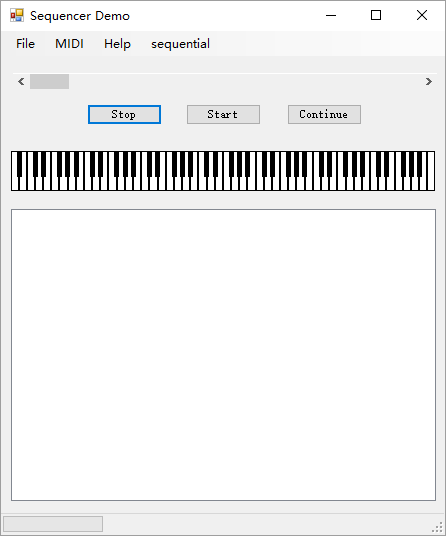

- [1. 功能概述](#1-功能概述)
- [2. 项目特色](#2-项目特色)
- [3. 代码总量](#3-代码总量)
- [4. 工作时间](#4-工作时间)
- [5. 结论](#5-结论)
    - [5.1. 实验过程](#51-实验过程)
        - [5.1.1. 编译源文件](#511-编译源文件)
        - [5.1.2. 控件+字体自适应大小](#512-控件字体自适应大小)
        - [5.1.3. WindowsForm拖拽事件](#513-windowsform拖拽事件)
        - [5.1.4. Open一个midi文件后立即播放](#514-open一个midi文件后立即播放)
        - [5.1.5. *解决线程冲突问题*](#515-解决线程冲突问题)
        - [5.1.6. 实现列表播放](#516-实现列表播放)
        - [5.1.7. 实现拖拽文件夹播放](#517-实现拖拽文件夹播放)
        - [5.1.8. 实现顺序播放随机播放](#518-实现顺序播放随机播放)
    - [5.2. 实验结果](#52-实验结果)

# 1. 功能概述

简单midi播放器，支持列表播放，随机播放，对界面设计进行了优化。

# 2. 项目特色

- [x] 控件+字体自适应大小
- [x] 列表循环播放（不用点startbutton）
- [x] 拖拽文件或文件夹播放
- [x] 顺序随机播放切换

# 3. 代码总量


本人添加的代码行数：250+

# 4. 工作时间

五天

# 5. 结论

## 5.1. 实验过程

### 5.1.1. 编译源文件

打开文件时会弹出错误，虽然并不影响播放。把路径`Sanford.Multimedia.Midi-master\Source\Sanford.Multimedia.Midi\Sequencing`下的`MidiFileProperties.cs`文件第247行的这句话注释掉就没事了。
``` cs
Debug.Assert(Division >= PpqnClock.PpqnMinValue);
```

### 5.1.2. 控件+字体自适应大小

参考博文：[Winform 窗体控件+字体自适应屏幕大小](https://www.cnblogs.com/bigcatblog/p/9663085.html)

步骤如下：

0. 添加类`
SizeFormClass.cs`。
1. 在需要自适应的`Form`中实例化全局变量
``` c#
SizeFormClass asc = new SizeFormClass();
```
2. `Form_Load`事件中
``` c#
asc.controllInitializeSize(this);
```
3. `Page_SizeChanged`事件中
``` c#
asc.controlSize(this);
```

### 5.1.3. WindowsForm拖拽事件

参考博文：[C#winform拖拽实现获得文件路径](https://www.cnblogs.com/JLZT1223/p/6113787.html)

1. 先把窗体的`properties`中的`AllowDrop`设为True。
2. 再写两个`Events`

``` c#
private void Form1_DragEnter(object sender, DragEventArgs e) //获得“信息”
{
    if (e.Data.GetDataPresent(DataFormats.FileDrop)) //重要代码：表明是所有类型的数据，比如文件路径
    {
        e.Effect = DragDropEffects.All;
    }
    else
    {
        e.Effect = DragDropEffects.None;
    }
}

private void Form1_DragDrop(object sender, DragEventArgs e) //解析信息
{
    string fileName = ((string[])e.Data.GetData(DataFormats.FileDrop))[0]; //获得路径
    Open(fileName); //调用midi内部方法打开midi文件
}
```

### 5.1.4. Open一个midi文件后立即播放

`Open`方法调用了`sequence1.LoadAsync();`方法，这是异步执行的，直接调用`startButton_Click`事件会造成线程冲突。解决方案如下：

方法一：查看`sequence1.IsBusy`判断是否正在加载，等待其`false`就开始调用`startButton_Click`事件。但这样会造成死锁，因为主线程一直在等待，而其他线程因为主线程繁忙而一直不得执行，这样主线程就会一直等待下去。解决方法就是加上`Application.DoEvents();`，使主线程释放资源调用其他线程。

```csharp
while (sequence1.IsBusy)
{
    Application.DoEvents();
    System.Threading.Thread.Sleep(100);
}
```

方法二：在`HandleLoadCompleted`事件后直接调用`startButton_Click`事件。

### 5.1.5. *解决线程冲突问题*

需要调用的事件先定义对应的委托，然后在子线程中使用`this.BeginInvoke(new funcDG(func),...);`方法，调用主线程执行。

### 5.1.6. 实现列表播放

1. 添加控件listBox，显示播放列表。

2. 添加三个全局变量

```csharp
private int count;               //当前播放的歌曲
FileInfo[] playlist;             //保存歌曲路径信息
Dictionary<string, int> songid;  //保存歌曲在playlist里的id
```

3. 添加一个openPlaylistToolStripMenuItem控件，用于打开一个文件夹，添加click事件：

```csharp
private void openPlaylistToolStripMenuItem_Click(object sender, EventArgs e)
{
    // https://www.cnblogs.com/tinaluo/p/6636073.html
    FolderBrowserDialog folderDialog = new FolderBrowserDialog();
    folderDialog.Description = "Open playlist";

    if (folderDialog.ShowDialog() == DialogResult.OK)
    {
        string folderPath = folderDialog.SelectedPath;
        // http://www.cnblogs.com/willingtolove/p/9235353.html
        playlist = new DirectoryInfo(folderPath).GetFiles("*.mid");
        songid = new Dictionary<string, int>();
        listBox1.Items.Clear();
        for (int i = 0; i < playlist.Length; i++)
        {
            string name = Path.GetFileNameWithoutExtension(playlist[i].FullName);
            string fullname = playlist[i].FullName;
            listBox1.Items.Add(name);
            songid[name] = i;
        }

        //playNext();
        ...
    }
}
```

4. 添加`playNext()`方法，用于播放下一首：

```csharp
private void playNext()
{
    listBox1.SetSelected(count, true);
    Open(playlist[count].FullName);

    //count=nextCount();
    ...

    //startButton_Click(sender, e);
    ...
}
```

5. 定义playNext的委托，然后在`HandlePlayingCompleted`事件中添加如下代码，表示一首播放完毕后，立即播放下一首。这里委托主线程调用，避免线程冲突。

```csharp
this.BeginInvoke(new playNextDG(playNext));
```

### 5.1.7. 实现拖拽文件夹播放

修改代码如下：

```csharp
private void Form1_DragDrop(object sender, DragEventArgs e)
{
    //获取文件路径
    string fileName = ((string[])e.Data.GetData(DataFormats.FileDrop))[0];

    if (Directory.Exists(fileName)) //路径
    {
        ...
    }
    else if (File.Exists(fileName)) //文件
    {
        ...
    }

    //播放下一首
    ...
}
```

### 5.1.8. 实现顺序播放随机播放

添加全局变量：

```csharp
private bool sequential=true;        //全局变量表示当前是否顺序随机播放
private Random rd = new Random();
```

添加一个`ToolStripMenuItem`控件，添加click事件：

```csharp
private void tmpToolStripMenuItem_Click(object sender, EventArgs e)
{
    sequential = !sequential;
    tmpToolStripMenuItem.Text = sequential ? "sequential" : "random";
}
```

修改`count`代码

```csharp
count = sequential ? 0 : rd.Next(0, playlist.Length - 1);

//in playNext()
if (sequential)
{
    count = (count + 1) % playlist.Length;
}
else
{
    count = rd.Next(0, playlist.Length - 1);
}
```

## 5.2. 实验结果

>一图胜千言<br>A beautiful demo is worth a thousand words

最初的功能——控件+字体自适应大小：


初始界面：



播放demo：

