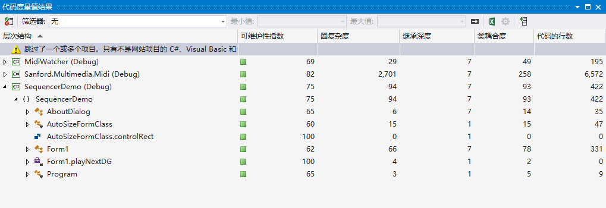

<!-- TOC -->

- [1. 功能概述](#1-功能概述)
- [2. 项目特色](#2-项目特色)
- [3. 代码总量](#3-代码总量)
- [4. 工作时间](#4-工作时间)
- [5. 结论](#5-结论)
    - [5.1. 实验过程](#51-实验过程)
        - [5.1.1. 编译源文件](#511-编译源文件)
        - [5.1.2. 控件+字体自适应大小](#512-控件字体自适应大小)
        - [5.1.3. WindowsForm拖拽事件](#513-windowsform拖拽事件)
    - [5.2. 实验结果](#52-实验结果)

<!-- /TOC -->

# 1. 功能概述

1. 成功编译C# MIDI Toolkit提供的演示程序。并能正常播放MIDI文件。
2. 对GUI界面中的控件大小、位置进行完善，使之能够随APP界面大小自动调整其自身大小。
3. 拖拽midi文件到窗口内进行播放。

# 2. 项目特色

1. 控件+字体自适应大小。
2. 拖拽midi文件到窗口内进行播放。

# 3. 代码总量



本人添加的代码行数：150+

# 4. 工作时间

一天

# 5. 结论

## 5.1. 实验过程

### 5.1.1. 编译源文件

打开文件时会弹出错误，虽然并不影响播放。把路径`Sanford.Multimedia.Midi-master\Source\Sanford.Multimedia.Midi\Sequencing`下的`MidiFileProperties.cs`文件第247行的这句话注释掉就没事了。
``` cs
Debug.Assert(Division >= PpqnClock.PpqnMinValue);
```

### 5.1.2. 控件+字体自适应大小

参考博文：[Winform 窗体控件+字体自适应屏幕大小](https://www.cnblogs.com/bigcatblog/p/9663085.html)

步骤如下：

0. 添加类`
SizeFormClass.cs`。
1. 在需要自适应的`Form`中实例化全局变量
``` c#
SizeFormClass asc = new SizeFormClass();
```
2. `Form_Load`事件中
``` c#
asc.controllInitializeSize(this);
```
3. `Page_SizeChanged`事件中
``` c#
asc.controlSize(this);
```

### 5.1.3. WindowsForm拖拽事件

参考博文：[C#winform拖拽实现获得文件路径](https://www.cnblogs.com/JLZT1223/p/6113787.html)

1. 先把窗体的`properties`中的`AllowDrop`设为True。
2. 再写两个`Events`

``` c#
private void Form1_DragEnter(object sender, DragEventArgs e) //获得“信息”
{
    if (e.Data.GetDataPresent(DataFormats.FileDrop)) //重要代码：表明是所有类型的数据，比如文件路径
    {
        e.Effect = DragDropEffects.All;
    }
    else
    {
        e.Effect = DragDropEffects.None;
    }
}

private void Form1_DragDrop(object sender, DragEventArgs e) //解析信息
{
    string fileName = ((string[])e.Data.GetData(DataFormats.FileDrop))[0]; //获得路径
    Open(fileName); //调用midi内部方法打开midi文件
}
```

## 5.2. 实验结果

>一图胜千言<br>A beautiful demo is worth a thousand words

注：video路径下res.mkv，更高的画质、1/10的体积于res.gif

