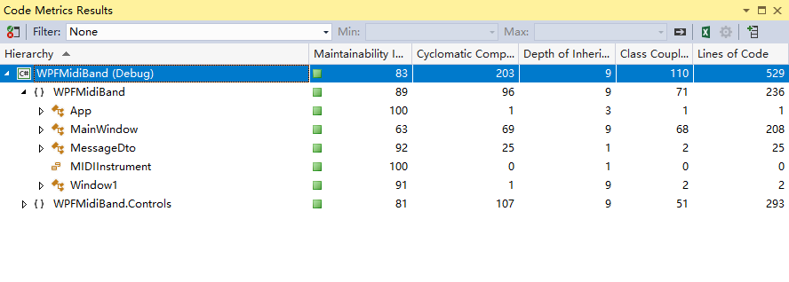

<!-- TOC -->

- [1. 功能概述](#1-功能概述)
- [2. 项目特色](#2-项目特色)
- [3. 代码总量](#3-代码总量)
- [4. 工作时间](#4-工作时间)
- [5. 结论](#5-结论)
    - [5.1. 实验过程](#51-实验过程)
        - [5.1.1. 窗口自适应大小](#511-窗口自适应大小)
        - [5.1.2. 拖拽midi文件播放](#512-拖拽midi文件播放)
    - [5.2. 实验结果](#52-实验结果)

<!-- /TOC -->

# 1. 功能概述

1. 成功编译WPF Midi Band提供的演示程序。并能正常播放MIDI文件。
2. 对GUI界面中的控件大小、位置进行完善，使之能够随APP界面大小自动调整其自身大小。
3. 拖拽midi文件到窗口内进行播放。

# 2. 项目特色

1. 控件+字体自适应大小。
2. 拖拽midi文件到窗口内进行播放。

# 3. 代码总量



本人添加的代码行数：40+。

# 4. 工作时间

一天

# 5. 结论

## 5.1. 实验过程

### 5.1.1. 窗口自适应大小

参考博文：[WPF自适应窗体大小](https://www.cnblogs.com/xuange/p/3667938.html)

在`StackPanel`外面套上一个`Viewbox`即可，不仅图案而且字体也自适应变化。

``` xml
<Viewbox VerticalAlignment="Top">
    <StackPanel HorizontalAlignment="Center">
        ...
    </StackPanel>
</Viewbox>
```

### 5.1.2. 拖拽midi文件播放

参考上一个实验`Experiment2`，操作几乎不变。

## 5.2. 实验结果

>一图胜千言<br>A beautiful demo is worth a thousand words

注：video路径下的res.mkv文件，1/2的速率、4倍的分辨率、更高的画质、1/3.6的体积于res.gif。

