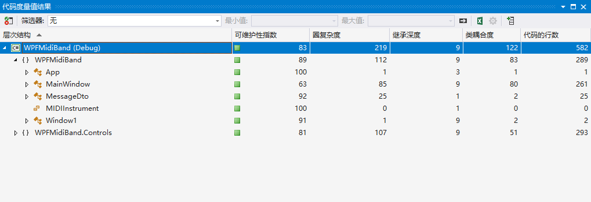
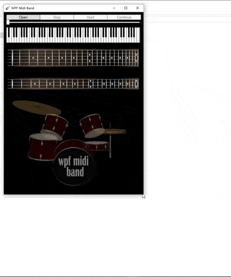

- [1. 功能概述](#1-功能概述)
- [2. 项目特色](#2-项目特色)
- [3. 代码总量](#3-代码总量)
- [4. 工作时间](#4-工作时间)
- [5. 结论](#5-结论)
    - [5.1. 实验过程](#51-实验过程)
        - [5.1.1. 窗口自适应大小](#511-窗口自适应大小)
        - [5.1.2. 拖拽midi文件播放](#512-拖拽midi文件播放)
        - [5.1.3. *解决线程冲突问题*](#513-解决线程冲突问题)
        - [5.1.4. 列表播放功能：](#514-列表播放功能)
            - [5.1.4.1 界面设计](#5141-界面设计)
            - [5.1.4.2 变量方法一览：](#5142-变量方法一览)
            - [5.1.4.3. 方法详解：](#5143-方法详解)
    - [5.2. 实验结果](#52-实验结果)
        - [5.2.1. 最初版本](#521-最初版本)
        - [5.2.2. 最新版本](#522-最新版本)

# 1. 功能概述

列表循环随机播放，界面优化。

# 2. 项目特色

- [x] 列表循环随机播放。
- [x] 控件+字体自适应大小。
- [x] 可拖拽单个midi文件或文件夹进行播放。
- [x] 播放列表可隐藏可展开。
- [x] 双击曲目进行播放。

# 3. 代码总量



本人添加的代码行数：200+。

# 4. 工作时间

五天

# 5. 结论

## 5.1. 实验过程

### 5.1.1. 窗口自适应大小

参考博文：[WPF自适应窗体大小](https://www.cnblogs.com/xuange/p/3667938.html)

在`StackPanel`外面套上一个`Viewbox`即可，不仅图案而且字体也自适应变化。

``` xml
<Viewbox VerticalAlignment="Top">
    <StackPanel HorizontalAlignment="Center">
        ...
    </StackPanel>
</Viewbox>
```

### 5.1.2. 拖拽midi文件播放

参考上一个实验`Experiment2`，操作几乎不变。

### 5.1.3. *解决线程冲突问题*

几乎所有线程冲突问题，无论是在`windowsform`还是在`wpf`，都是由于一个线程试图修改另一个线程内容而产生的。为此微软有独特的解决方案：

```csharp
// in windowsform
controls.invoke(new action(...));
// in wpf
controls.Dispatcher.invoke(new action(...));
```

以上两条语句指定了`control`去执行一个委托。在本次的两个实验中，几乎所有冲突都是关于控件对应的线程尝试修改主线程内容产生的。解决方法就是在子线程中调用主线程去修改主线程的内容，在`wpf`中，就是：

```csharp
this.Dispatcher.BeginInvoke(new Action(...)); //Begin表示并行执行
```

### 5.1.4. 列表播放功能：

#### 5.1.4.1 界面设计

考虑到原有界面已经很漂亮了，我决定尽可能在不改动原界面的前提下进行功能的追加。现在，我想要加上一个播放列表，所以我才用的解决方案是，添加一个可选的按钮，当用户希望看到播放列表的时候点击该按钮可弹出播放列表，当用户不希望看到播放列表时，点击这个按钮可隐藏播放列表。

除此之外，充分利用wpf中grid中进行排版，可以省去自己挨个排列控件的功夫。

`xmal`代码：

```xml
<Viewbox VerticalAlignment="Top">
    <Grid Margin="10">
        <Grid.ColumnDefinitions>
            <ColumnDefinition/>
            <ColumnDefinition/>
        </Grid.ColumnDefinitions>

        <ListView x:Name="listView"
                    Grid.Column="1"
                    Background="#FF170303"
                    Foreground="#FFB65708"
                    Visibility="Collapsed"
                    MouseDoubleClick="listView_MouseDoubleClick" >
            <ListView.View>
                <GridView>
                    <GridViewColumn Header="playlist"/>
                </GridView>
            </ListView.View>
        </ListView>

        <Grid Grid.Column="0">
                <StackPanel HorizontalAlignment="Center">
                    <Grid>
                        ...
                        <Button x:Name="btnPlaylist" Content="playlist" Grid.Column="4" Click="btnPlaylist_Click"/>
                        <Button x:Name="btnRandom" Content="sequential" Grid.Column="5" Click="btnRandom_Click"/>
                        <Button x:Name="hidePlaylist" Content="..." Grid.Column="6" Click="hidePlaylist_Click"/>
                    </Grid>
                    ...
                </StackPanel>
                ...
            </Grid>
        
    </Grid>
</Viewbox>
```

以上代码添加了一个`listview`和三个`button`。其中`listview`用于显示播放列表，默认背景颜色和前景色进行了修改以适应原有界面风格，默认时隐藏模式，只有当用户点击展开按钮时才会显示，同样，再次点击展开按钮就会隐藏。三个`button`分别是从一个文件夹打开一堆midi文件、开启随机播放模式，展开隐藏播放列表按钮，对应的事件随后介绍。

#### 5.1.4.2 变量方法一览：

```csharp
private int count;               //当前播放的歌曲
FileInfo[] playlist;             //保存歌曲路径信息
Dictionary<string, int> songid;  //保存歌曲在playlist里的id
private bool sequential = true;  //表示当前是否顺序随机播放
private Random rd = new Random();
private void Window_Drop(object sender, System.Windows.DragEventArgs e); //拖拽一个midi文件进行播放或者一个文件夹进行播放
private void Open();               //将内部打开一个midi文件的代码独立封装出来一个open方法
private void playNext();           //播放下一首曲目
private void hidePlaylist_Click(); //点击按钮隐藏或者展开播放列表
private void btnPlaylist_Click();  //点击打开一个文件夹进行播放
private void btnRandom_Click();    //点击在顺序播放和随机播放模式之间进行切换
private void listView_MouseDoubleClick(); //双击曲目可进行播放曲目
```

#### 5.1.4.3. 方法详解：

```csharp
/// <summary>
/// 拖拽一个midi文件进行播放或者一个文件夹进行播放
/// </summary>
/// <param name="sender"></param>
/// <param name="e"></param>
private void Window_Drop(object sender, System.Windows.DragEventArgs e)
{
    if (e.Data.GetDataPresent(System.Windows.Forms.DataFormats.FileDrop))
    {
        fileName = ((string[])e.Data.GetData(System.Windows.Forms.DataFormats.FileDrop))[0]; //获得路径

        if (Directory.Exists(fileName)) //路径
        {   //保存曲目信息
            playlist = new DirectoryInfo(fileName).GetFiles("*.mid");
            songid = new Dictionary<string, int>();
            listView.Items.Clear();
            for (int i = 0; i < playlist.Length; i++)
            {
                string name = System.IO.Path.GetFileNameWithoutExtension(playlist[i].FullName);
                string fullname = playlist[i].FullName;
                listView.Items.Add(name);
                songid[name] = i;
            }
        }
        else if (File.Exists(fileName)) //文件
        {   //保存曲目信息
            playlist = new FileInfo[1];
            playlist[0] = new FileInfo(fileName);
            songid = new Dictionary<string, int>();
            string name = System.IO.Path.GetFileNameWithoutExtension(fileName);
            string fullname = fileName;
            listView.Items.Clear();
            listView.Items.Add(name);
            songid[name] = 0;
        }

        //播放下一首
        count = sequential ? 0 : rd.Next(0, playlist.Length - 1);
        playNext();
    }
}
```

```csharp
/// <summary>
/// 播放下一首
/// </summary>
private void playNext()
{
    listView.SelectedIndex = count;              //播放列表对当前播放曲目进行高亮
    fileName = playlist[count].FullName;         //调用原有方法打开midi文件进行播放
    Open();
    if (sequential)                              //下一首取决于当前播放模式
    {
        count = (count + 1) % playlist.Length;
    }
    else
    {
        count = rd.Next(0, playlist.Length - 1);
    }
}
```

```csharp
/// <summary>
/// //展开或隐藏播放列表
/// </summary>
/// <param name="sender"></param>
/// <param name="e"></param>
private void hidePlaylist_Click(object sender, RoutedEventArgs e)
{
    if (listView.Visibility == Visibility.Visible)
    {
        listView.Visibility = Visibility.Collapsed;
    }
    else
    {
        listView.Visibility = Visibility.Visible;
    }
}
```

```csharp
/// <summary>
/// 从一个文件夹打开一堆midi文件
/// </summary>
/// <param name="sender"></param>
/// <param name="e"></param>
private void btnPlaylist_Click(object sender, RoutedEventArgs e)
{
    FolderBrowserDialog folderDialog = new FolderBrowserDialog(); //文件夹打开对话框
    folderDialog.Description = "Open playlist";

    if (folderDialog.ShowDialog() == System.Windows.Forms.DialogResult.OK)
    {
        string folderPath = folderDialog.SelectedPath;            //保存midi文件信息
        // http://www.cnblogs.com/willingtolove/p/9235353.html
        playlist = new DirectoryInfo(folderPath).GetFiles("*.mid");
        songid = new Dictionary<string, int>();
        listView.Items.Clear();
        for (int i = 0; i < playlist.Length; i++)
        {
            string name = System.IO.Path.GetFileNameWithoutExtension(playlist[i].FullName);
            string fullname = playlist[i].FullName;
            listView.Items.Add(name);
            songid[name] = i;
        }
        //根据当前播放模式播放下一首
        count = sequential ? 0 : rd.Next(0, playlist.Length - 1);
        playNext();
    }
}
```

```csharp
/// <summary>
/// 切换当前播放模式
/// </summary>
/// <param name="sender"></param>
/// <param name="e"></param>
private void btnRandom_Click(object sender, RoutedEventArgs e)
{
    sequential = !sequential;
    btnRandom.Content = sequential ? "sequential" : "random";
}
```

```csharp
/// <summary>
/// 可双击曲目进行播放
/// </summary>
/// <param name="sender"></param>
/// <param name="e"></param>
private void listView_MouseDoubleClick(object sender, MouseButtonEventArgs e)
{
    count = songid[listView.SelectedItem.ToString()];
    this.Dispatcher.BeginInvoke(new Action(playNext));
}
```

## 5.2. 实验结果

>一图胜千言<br>A beautiful demo is worth a thousand words

### 5.2.1. 最初版本



### 5.2.2. 最新版本


（如果图片太大无法查看可以下载video/路径下的原视频查看）
