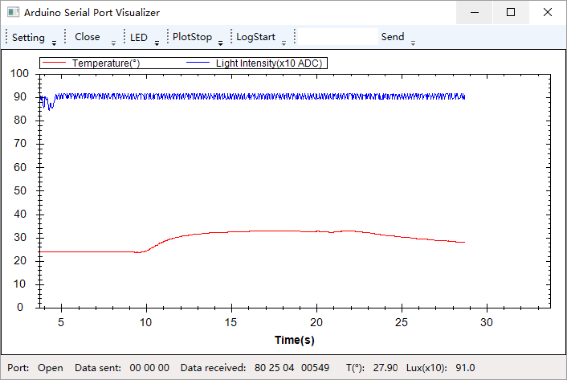
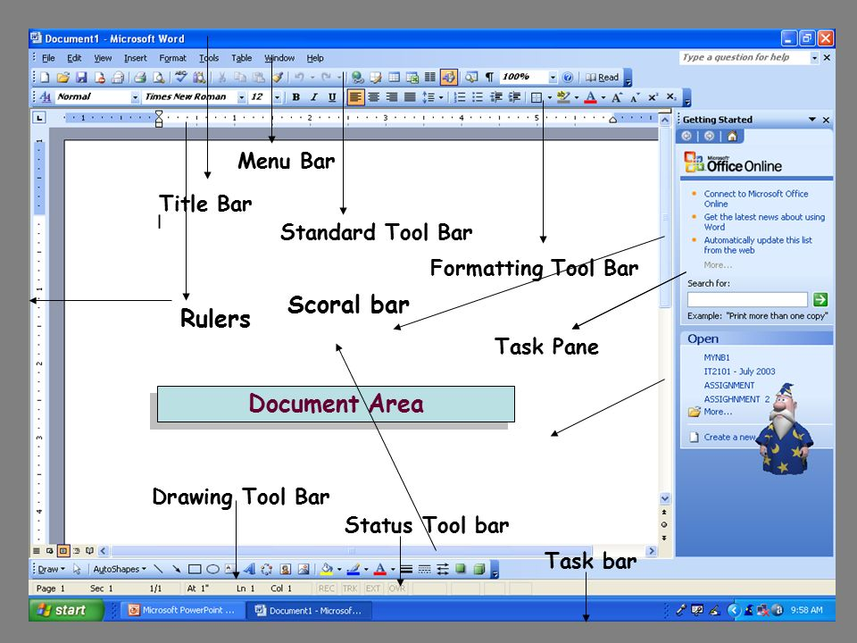
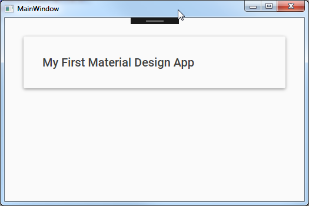
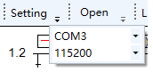
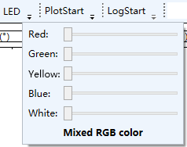
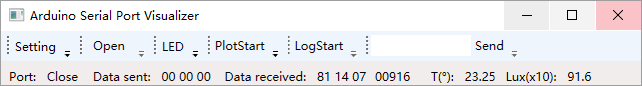
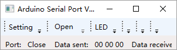
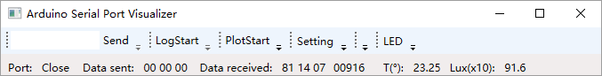

Arduino Serial Port Visualizer

Arduino Serial Port 可视化工具（搭配计组实验三midi协议食用

- [功能概述](#功能概述)
- [项目特色](#项目特色)
- [代码总量](#代码总量)
- [工作时间](#工作时间)
- [实验过程](#实验过程)
    - [界面设计](#界面设计)
        - [总体框架](#总体框架)
        - [工具栏](#工具栏)
        - [主界面](#主界面)
        - [状态栏](#状态栏)
        - [其它控件](#其它控件)
    - [代码设计](#代码设计)
        - [`arduino`代码](#arduino代码)
        - [`Binding`模板（参考章老师代码](#binding模板参考章老师代码)
        - [`SerialPort`相关操作](#serialport相关操作)
        - [“开”、“关”二合一](#开关二合一)
        - [`zedGraph`绘图](#zedgraph绘图)
        - [log相关操作](#log相关操作)
        - [完整源码](#完整源码)
- [Demo Time](#demo-time)

# 功能概述



- 指定波特率，动态获取串口
- LED灯亮度实时控制，RGB合成色
- 实时数据绘图，设定实时数据发送周期
- log记录数据json保存
- 手动发送数据
- 动态更新状态信息，包括串口打开情况，发送数据，接收数据，接收数据及其实际值，实时温度和光强

# 项目特色

- 状态栏-主体-状态栏可拓展布局设计
- Binding

# 代码总量

arduino 约 100 lines

C# 约 900 lines

# 工作时间

约一周

# 实验过程

## 界面设计

一个传统而普通的界面应该分为菜单栏、工具栏、主界面、状态栏等部分



在此基础上，再实现样式和内容的分离，用户可自由切换主题，例如有名的`material design`



本实验将绘图置于主界面，其他功能置于工具栏，实时数据显示置于状态栏，具有可拓展性，同时解决了窗体缩放的问题。

### 总体框架

采用了`Grid.RowDefinitions`划分界面

```xml
<Grid.RowDefinitions>
    <RowDefinition Height="30"/>
    <RowDefinition/>
    <RowDefinition Height="30"/>
</Grid.RowDefinitions>
```

前后两个分别为工具栏和状态栏，中间放绘图。

### 工具栏

参考 [ToolBar Overview | Microsoft Docs](https://docs.microsoft.com/en-us/dotnet/framework/wpf/controls/toolbar-overview)

`ToolBar`主要有以下但不限于功能：

参考 [ToolBar for WPF | ComponentOne](https://www.grapecity.com/controls/wpf/toolbar)

- 提供折叠、提示、对话启动功能。
- 溢出支持。控件随窗体大小自动调整，也可手动指定溢出。
- 定制button风格和下拉。例如内嵌小图片。
- 工具位置支持移动。可根据喜好手动调整工具的位置。
- 自动排列，可横可竖，可分行分列。
- 方便调整样式。

代码示例：

    <ToolBarTray Grid.Row="0" Orientation="Horizontal" VerticalAlignment="Top">
        <ToolBar Header="Setting" BandIndex="1">
            <ComboBox x:Name="comboBoxPort"  
                        ToolBar.OverflowMode="Always"
                        DropDownOpened="ComboBoxPort_DropDownOpened"
                        MinWidth="100"/>
            <ComboBox x:Name="comboBoxBaud" 
                        ToolBar.OverflowMode="Always"
                        MinWidth="100"/>
        </ToolBar>
        ...
    </ToolBarTray>

其中`ToolBarTray`相当于`StackPannel`用于排列`ToolBar`控件，`Orientation="Horizontal" `指定是横向的工具栏；`ToolBar`定义了“一块”工具栏，`Header`定义了名称，`BandIndex="1"`制定了工具栏的初始位置。`ToolBar.OverflowMode="Always"`表示手动指定永远溢出，即需要手动点击展开才能看见。还有一个`ToolTip`指定了说明信息，当光标停留其上时显示提示信息。

效果截图：



结合`StackPannel`或者`Grid`可以实现更自由的排列：



更多效果图：

窗体纵向缩小时：



窗体横向缩小时：



用户根据喜好调整工具顺序：



### 主界面

主界面放置绘图的`zedGraph`

    <wpf:WindowsFormsHost Grid.Row="1">
        <wpf:WindowsFormsHost.Child>
            <zed:ZedGraphControl x:Name="zedgraph" />
        </wpf:WindowsFormsHost.Child>
    </wpf:WindowsFormsHost>

由于`zedGraph`自身自动支持缩放功能，所以整个效果最后看来也是缩放自如的。

### 状态栏

采用了`StatusBar`。里面显示一些文本信息，并用`Binding`动态更新。

    <StatusBar x:Name="statusBarMidiData" Grid.Row="2">
        <Label Content="Port:"/>
        <TextBlock x:Name="textBlockStatus" Text="Close" Width="35" />
        ...
    </StatusBar>

状态栏目前包含的数据有：串口开关状态，发送的数据，接收的数据（包含实际值），实时温度，实时光强（ADC数值除以10，以便绘图）

### 其它控件

`Slider`：

    <Slider VerticalAlignment="Center" 
            Width="150" 
            IsSnapToTickEnabled="True"
            Tag="Red"
            ValueChanged="Slider_ValueChanged"/>

其中，`Slider`默认范围是0-10，步长为1，`IsSnapToTickEnabled="True"`表示不用浮点数表示而用整数表示value，如此再映射为控制LED的数值范围0-255即可。`ValueChanged="Slider_ValueChanged"`挂钩事件，其中`Tag`标识了是哪个LED灯。

## 代码设计

### `arduino`代码

参照计组实验三

- 根据midi协议，字节最高位为1时为头部，为0时为数据。接收数据时检查最高位，防止出现数据漏掉的情况。
- 返回给PC的数据依据第一个字节区分内容。
- 新增一个功能，可以修改发送实时数据的周期。

```c
int cnt,pwm[16]; //计数器，保存pwm数值
const int led[]={3,5,6,9,10}; //led引脚号
uint8_t mi[3],cmd,cnl,rt[3]; //midi协议数据，命令、通道号，发送给PC的数据
const uint8_t invld[]={0xfa,0x7f,0x7f}; //用于非法数据返回码
uint32_t pre,period=1000; //维护前一次的时间戳，发送给PC的周期（ms）
void show(uint8_t data[3]) { Serial.write(data,3); } //发送PC数据
int ntc() { return analogRead(A0); } //返回温度ADC
int rcds() { return analogRead(A1); } //返回光强ADC
int getVal() { return ((int)mi[2]<<7)|mi[1]; } //解析midi数据的实际值
void setrt(uint8_t head, uint16_t x) //设置返回码
{
  rt[0]=head;
  rt[1]=(x&0x7f);
  rt[2]=((x>>7)&0x7f);
}

void setup()
{ 
  Serial.begin(115200); //115200波特率
  for (int i=0; i<5; i++) {
    int r=led[i];
    pinMode(r,OUTPUT); //设定输出引脚
    digitalWrite(r,HIGH);
    pwm[r]=1023; //保存pwm值
  }
}

void loop()
{
  if (millis()-pre>period) { //大于一个周期没有收到数据，返回PC监听值
    pre=millis();
    setrt(0x80,ntc()); show(rt); //返回温度ADC的监听值
    setrt(0x81,rcds()); show(rt); //返回光强ADC的监听值
  }
  
  if(Serial.available()>0)
  {
    pre=millis(); //重置时间戳
    
    uint8_t ch=Serial.read(); //读取PC数据
    if (ch>>7) cnt=0; //midi协议头部
    mi[cnt++]=ch; //保存收到的数据
    
    if (cnt==3) { //达到midi协议的3字节
      cnt=0; //重置计数器

      cmd=(mi[0]>>4)&0xf; //解析命令
      cnl=mi[0]&0xf; //解析通道号

      memcpy(rt,invld,sizeof(rt)); //默认是非法数据
      switch (cmd) {
        case 0x9:
          if (mi[1]<2) {
            digitalWrite(cnl,mi[1]); //设置引脚电平
            setrt(mi[0],digitalRead(cnl));
          }
          break;
        case 0xa: //set period
          period=getVal(); //自定义，设置周期
          break;
        case 0xc:
          if (mi[1]==0x66) setrt(mi[0],digitalRead(cnl)); //读取引脚电平
          break;
        case 0xd:          
          if (!(mi[2]>>6)) {
            int tmp=mi[1]|((mi[2]&1)<<7);
            analogWrite(cnl,tmp); //pwm写
            pwm[cnl]=map(tmp,0,255,0,1023); //维护pwm值
          }
          setrt(mi[0],pwm[cnl]); //返回对应值
          break;
        case 0xe:
          if (cnl<0x8 && mi[1]==0x11 && mi[2]==0x11) {
            setrt(mi[0],analogRead(cnl)); //读取ADC值
          }
          break;
        case 0xf:
          if (mi[1]==0x55 && mi[2]==0x55) {
            if (cnl==0xf) setrt(mi[0],millis()); //返回时间戳
            else if (cnl==0x9) setrt(mi[0],8061); //返回学号
          }
          break;
        default:
          break;
      }
      show(rt); //发送数据
      
    }
  }
}
```

### `Binding`模板（参考章老师代码

```c#
//先定义数据类
public class MidiData:INotifyPropertyChanged
{
    public event PropertyChangedEventHandler PropertyChanged;
    private void NotifyPropertyChanged([CallerMemberName] String propertyName = "")
    {
        PropertyChanged?.Invoke(this, new PropertyChangedEventArgs(propertyName));
    }

    private string dataString;
    public string DataString
    {
        get
        {
            return dataString;
        }
        set
        {
            if (dataString!=value)
            {
                dataString = value;
                NotifyPropertyChanged();
            }
        }
    }
}

//设置绑定，指定绑定属性、路径、源、模式，还可以设置转换器等
dataToSend.SetBinding(TextBox.TextProperty, new Binding("DataString") {
    Source=dataSent,
    Mode = BindingMode.OneWayToSource,
});
```

### `SerialPort`相关操作

获取串口名称

```c#
string[] portnames = SerialPort.GetPortNames();
```

初始化

```csharp
CloseSerialPort();
mySerialPort = new SerialPort(comboBoxPort.SelectedItem.ToString());

//串口设定初始化
mySerialPort.BaudRate = int.Parse(comboBoxBaud.SelectedItem.ToString());
mySerialPort.Parity = Parity.None;
mySerialPort.StopBits = StopBits.One;
mySerialPort.DataBits = 8;
mySerialPort.Handshake = Handshake.None;
mySerialPort.RtsEnable = false;
mySerialPort.ReceivedBytesThreshold = 1;
mySerialPort.DataReceived += new SerialDataReceivedEventHandler(DataReceivedHandler);

mySerialPort.Open();
```

其中关闭串口检查：

```csharp
void CloseSerialPort()
{
    if (mySerialPort != null)
    {
        mySerialPort.DataReceived -= new SerialDataReceivedEventHandler(DataReceivedHandler);
        mySerialPort.Close();
        Console.WriteLine("Closed:" + mySerialPort.ToString());
    }
}
```

接收数据挂钩事件：

```c#
private void DataReceivedHandler(
            object sender,
            SerialDataReceivedEventArgs e)
{
    if (mySerialPort==null)
    {
        return;
    }
    int bytesLength = mySerialPort.BytesToRead;
    for (int i = 0; i < bytesLength; i++)
    {
        int data = mySerialPort.ReadByte();
        ...
    }
}
```

发送数据：

```c#
mySerialPort.Write(data, 0, data.Length); //发送
```

### “开”、“关”二合一

把开按钮和关按钮合并了一下，节省界面空间。

```c#
private void ButtonOpenClose_Click(object sender, RoutedEventArgs e)
{
    Button now = sender as Button;
    if (now.Content.Equals("Open"))
    {
        textBlockStatus.Text = "Open";
        now.Content = "Close";
        ...
    }
    else
    {
        textBlockStatus.Text = "Close";
        now.Content = "Open";
        ...
    }
}
```

### `zedGraph`绘图

参考章老师源码

初始化

```c#
private void SetGraph()
{
    GraphPane myPane = zedgraph.GraphPane;
    myPane.Title.Text = ""; //标题
    myPane.XAxis.Title.Text = "Time(s)"; //X轴
    myPane.YAxis.Title.Text = ""; //Y轴
    RollingPointPairList list1 = new RollingPointPairList(1200); //第一条曲线，最多点数为1200
    RollingPointPairList list2 = new RollingPointPairList(1200); //第二条曲线，最多点数为1200
    LineItem curve1 = myPane.AddCurve("Temperature(°)", list1, System.Drawing.Color.Red, SymbolType.None/*.Diamond*/ ); //曲线风格
    LineItem curve2 = myPane.AddCurve("Light Intensity(x10 ADC)", list2, System.Drawing.Color.Blue, SymbolType.None);
    tickStart = Environment.TickCount; //获取当前时间戳
    zedgraph.AxisChange(); //更新X轴
}
```

添加数据点

```c#
void AddDataPoint(double dataX, int curId)
{
    if (zedgraph.GraphPane.CurveList.Count <= curId) return; //非法curId
    LineItem curve = zedgraph.GraphPane.CurveList[curId] as LineItem;
    if (curve == null) return; //空曲线
    IPointListEdit list = curve.Points as IPointListEdit;
    if (list == null) return; //空列表
    double time = (Environment.TickCount - tickStart) / 1000.0; //当前时间，单位为秒
    list.Add(time, dataX); //添加数据点
    Scale xScale = zedgraph.GraphPane.XAxis.Scale; //调整X轴
    if (time > xScale.Max - xScale.MajorStep)
    {
        xScale.Max = time + xScale.MajorStep;
        xScale.Min = xScale.Max - 30.0;
    }
    zedgraph.AxisChange(); //更新X轴
    zedgraph.Invalidate();
}
```

设定返回数据的周期时间

```c#
private void BtnSetPeriod_Click(object sender, RoutedEventArgs e)
{
    int res;
    bool parseRes = int.TryParse(textBoxSetPeriod.Text, out res);
    if (!parseRes || res<20 || res>16383)
    {
        //范围必须是[20,16383]ms
        MessageBox.Show("Please input a number within [20,16383].", "Warning");
        return;
    }
    if (mySerialPort != null)
    {
        mySerialPort.Write(midiDataFormat(0xa, 0, res), 0, 3); //发送指定的midi命令
    }
}
```

清空绘图窗口

```c#
private void BtnPlotClear_Click(object sender, RoutedEventArgs e)
{
    //清空所有曲线
    for (int idxList = 0; idxList < zedgraph.GraphPane.CurveList.Count; idxList++)
    {
        LineItem curve = zedgraph.GraphPane.CurveList[idxList] as LineItem;
        if (curve == null) return;
        IPointListEdit list = curve.Points as IPointListEdit;
        if (list == null) return;
        list.Clear();
    }
    tickStart = Environment.TickCount; //重设绘图起始时间
    double time = (Environment.TickCount - tickStart) / 1000.0;
    Scale xScale = zedgraph.GraphPane.XAxis.Scale; //更新X轴
    xScale.Max = time + xScale.MajorStep;
    xScale.Min = xScale.Max - 30.0;
    zedgraph.AxisChange();
    zedgraph.Refresh(); //刷新图像
}
```

### log相关操作

JSON序列化

参考 [How can I parse JSON with C#? - Stack Overflow](https://stackoverflow.com/questions/6620165/how-can-i-parse-json-with-c)

```c#
string logJSONString = JsonConvert.SerializeObject(logData); //格式化json字符串
System.IO.File.WriteAllText(logFileName, logJSONString); //写入到文件
```

`SaveFileDialog`

参考 [c# - WPF - SaveFileDialog - Stack Overflow](https://stackoverflow.com/questions/8147574/wpf-savefiledialog)

```c#
Microsoft.Win32.SaveFileDialog dlg = new Microsoft.Win32.SaveFileDialog(); //打开dlg
dlg.FileName = string.Format("log-{0:yyyy-mm-dd-hh-mm-ss}", DateTime.Now); //以当前时间初始化文件名
dlg.DefaultExt = ".json"; //默认格式
dlg.Filter = "(.json)|*.json"; //可选格式
Nullable<bool> result = dlg.ShowDialog(); //获取结果
if (result==false) //非法结果返回
{
    return false;
}
logFileName = dlg.FileName; //获取保存的路径
```

其他一些维护数据更新的代码，在此不再赘述，详见源码

### 完整源码

https://github.com/qq734628996/CSharp_Homework/tree/master/Experiment/Experiment4

# Demo Time

