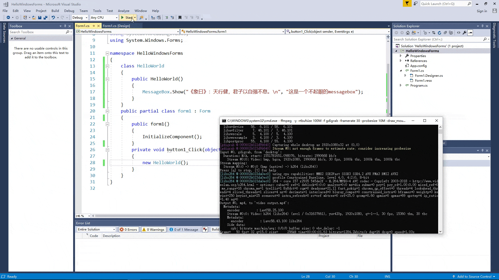
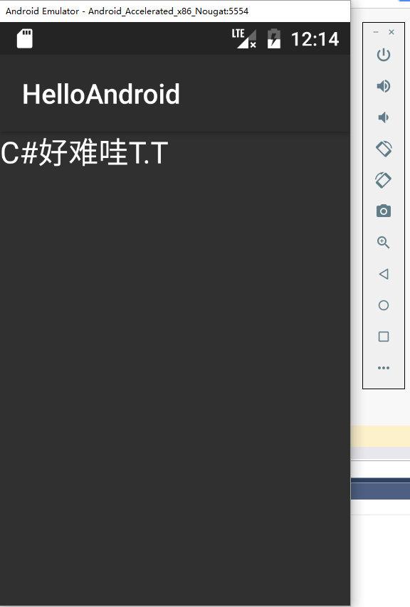

## TOC

<!-- TOC -->

- [2.1 实例化 HelloWorld](#21-实例化-helloworld)
- [2.2 创建新的类，静态方法，无需实例化的 HelloWorld](#22-创建新的类静态方法无需实例化的-helloworld)
- [2.3 WPF的HelloWorld](#23-wpf的helloworld)
    - [题目要求](#题目要求)
    - [思路 & 结果](#思路--结果)
- [2.4 WindowsForm，中创建新类的HelloWorld](#24-windowsform中创建新类的helloworld)
    - [windowsform helloworld v1.0](#windowsform-helloworld-v10)
    - [windowsform helloworld v2.0](#windowsform-helloworld-v20)
- [2.5 Xamarin Android HelloWorld 或IOS/Mac OS HelloWorld](#25-xamarin-android-helloworld-或iosmac-os-helloworld)

<!-- /TOC -->

## 2.1 实例化 HelloWorld
**作业要求**：创建新的类，实例化 HelloWorld

**思路**：如题，并添加了命令行参数

**结果**：

## 2.2 创建新的类，静态方法，无需实例化的 HelloWorld
**作业要求**：rt

**思路**：由作业2.1简单修改得到

**结果**：

## 2.3 WPF的HelloWorld
### 题目要求
rt
### 思路 & 结果
拖控件的作业，于是拖了两个控件（~~其实只是加了两行代码……~~

1. 一个是image控件，用于显示背景
2. 一个是textblock控件，用于显示文字，顺便改了下字体和大小
3. 还有一个是把窗口名字改成了**HelloWPF**

## 2.4 WindowsForm，中创建新类的HelloWorld
### windowsform helloworld v1.0
又是拖控件……

先放图：

1. 需要创建新类，于是我就建了一个新类。。
2. 用了一个button和messagebox

放个gif：（~~测试mp4播放失败~~

但是放个gif也能卡成ppt，只能说是我的网卡:smiley:

### windowsform helloworld v2.0

## 2.5 Xamarin Android HelloWorld 或IOS/Mac OS HelloWorld
又双叒叕是拖控件……不过这次好难啊，我都快哭了

参考[官网教程](https://docs.microsoft.com/en-us/xamarin/android/get-started/hello-android/hello-android-quickstart?pivots=windows)

