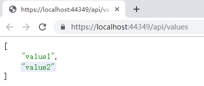
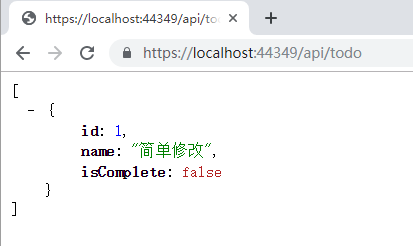
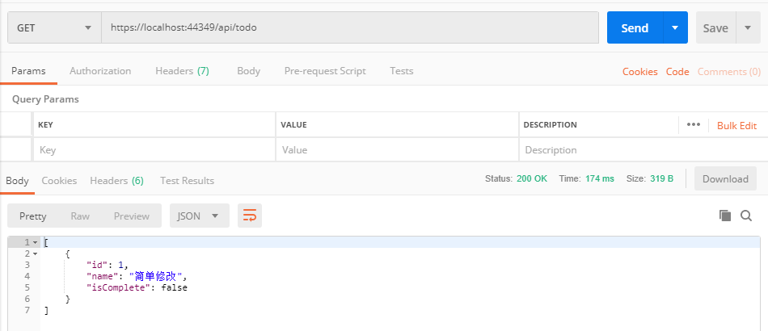
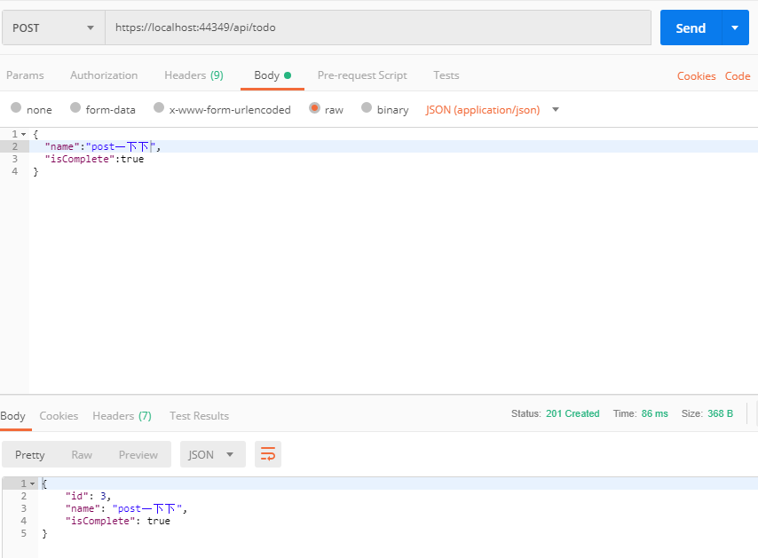
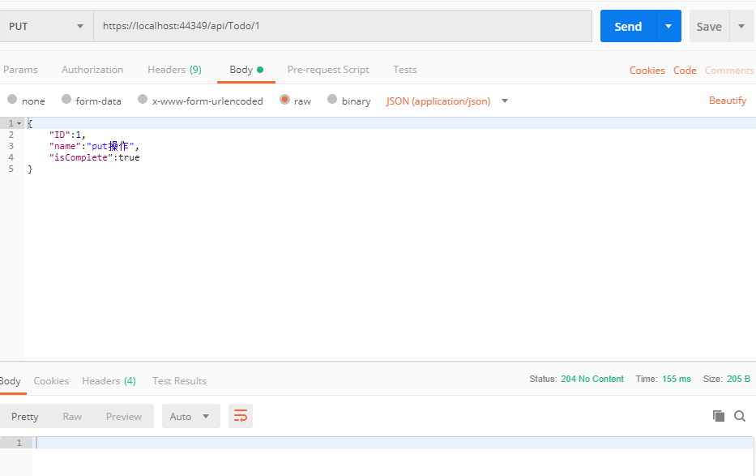
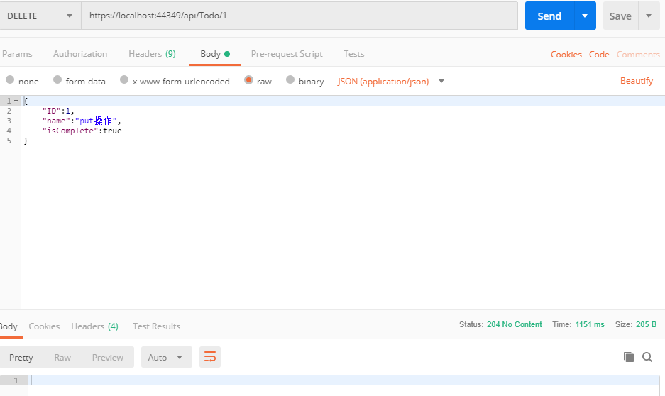
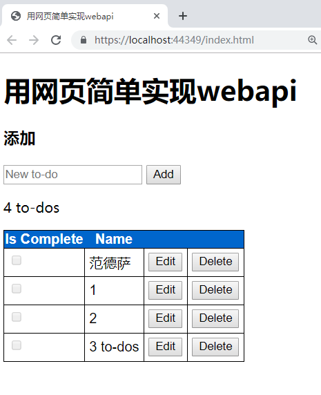
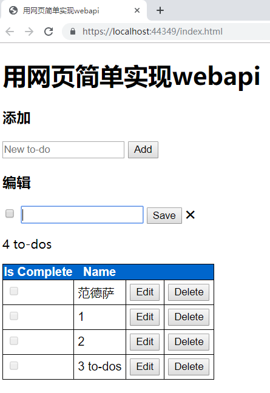

# 学习 C# Web Api

## 参考官网教程：

[Tutorial: Create a web API with ASP.NET Core MVC | Microsoft Docs](https://docs.microsoft.com/en-us/aspnet/core/tutorials/first-web-api?view=aspnetcore-2.2&tabs=visual-studio)

## 环境需求：

- vs2017 v15.9

- [.NET Core 2.2](https://dotnet.microsoft.com/download/thank-you/dotnet-sdk-2.2.202-windows-x64-installer)

- [Postman](https://www.getpostman.com/apps)

## GET

## POST

## PUT

## DELETE

## 用网页的形式

