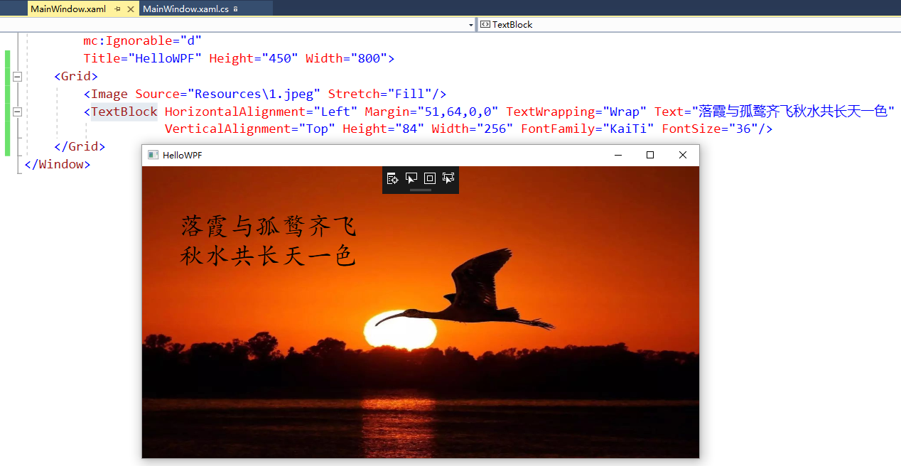
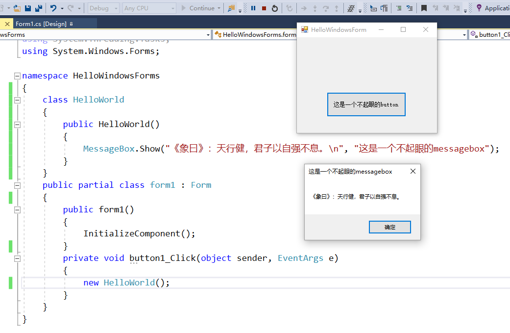

# CSharp_hw

这是一个苦逼学生的C#作业

# TOC

<!-- TOC -->

- [CSharp_hw](#csharp_hw)
- [TOC](#toc)
- [作业1](#作业1)
    - [这是一个大写的标题](#这是一个大写的标题)
- [作业2](#作业2)
    - [2.1 实例化 HelloWorld](#21-实例化-helloworld)
    - [2.2 创建新的类，静态方法，无需实例化的 HelloWorld](#22-创建新的类静态方法无需实例化的-helloworld)
    - [2.3 WPF的HelloWorld](#23-wpf的helloworld)
    - [2.4 WindowsForm，中创建新类的HelloWorld](#24-windowsform中创建新类的helloworld)
        - [windowsform helloworld v1.0](#windowsform-helloworld-v10)
        - [windowsform helloworld v2.0](#windowsform-helloworld-v20)
    - [2.5 Xamarin Android HelloWorld 或IOS/Mac OS HelloWorld](#25-xamarin-android-helloworld-或iosmac-os-helloworld)

<!-- /TOC -->

# 作业1

## 这是一个大写的标题
1. 强势观摩了老师的代码，所以作业1没什么难度……
2. 顺便盗用了下老师的gitignore文件……
2. 主要学习了一下廖雪峰的git教程，这是我的[学习笔记](https://github.com/qq734628996/git-learn)

# 作业2

## 2.1 实例化 HelloWorld

如题，并添加了命令行参数

## 2.2 创建新的类，静态方法，无需实例化的 HelloWorld

由作业2.1简单修改得到

## 2.3 WPF的HelloWorld

拖控件的作业，于是拖了两个控件（~~其实只是加了两行代码……~~

1. 一个是image控件，用于显示背景
2. 一个是textblock控件，用于显示文字，顺便改了下字体和大小
3. 还有一个是把窗口名字改成了**HelloWPF**

## 2.4 WindowsForm，中创建新类的HelloWorld

### windowsform helloworld v1.0
又是拖控件……

先放图：

1. 需要创建新类，于是我就建了一个新类。。
2. 用了一个button和messagebox

放个gif：（~~测试mp4播放失败~~

但是放个gif也能卡成ppt，只能说是我的网卡:smiley:

### windowsform helloworld v2.0

## 2.5 Xamarin Android HelloWorld 或IOS/Mac OS HelloWorld
又双叒叕是拖控件……不过这次好难啊，我都快哭了

参考[官网教程](https://docs.microsoft.com/en-us/xamarin/android/get-started/hello-android/hello-android-quickstart?pivots=windows)

