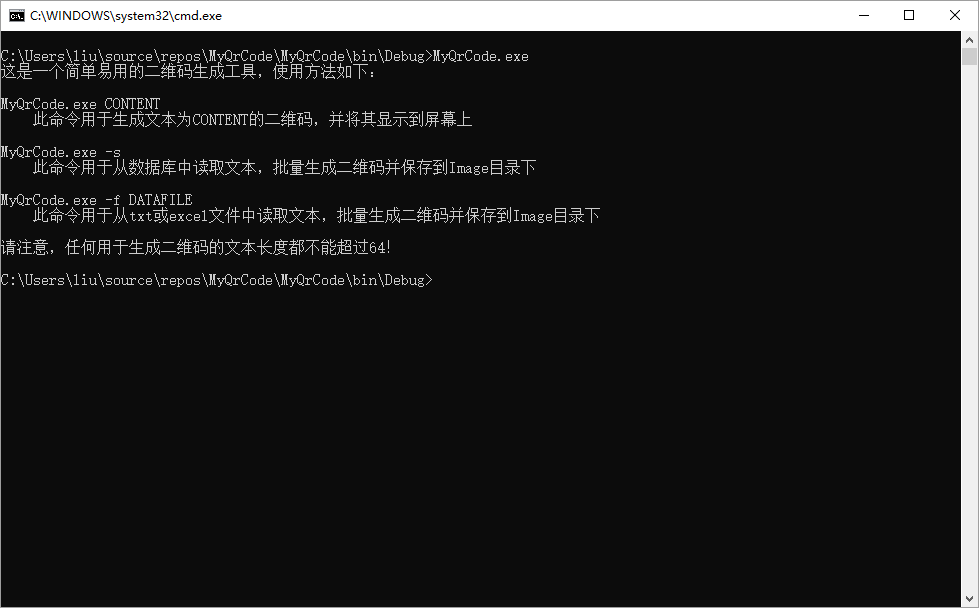
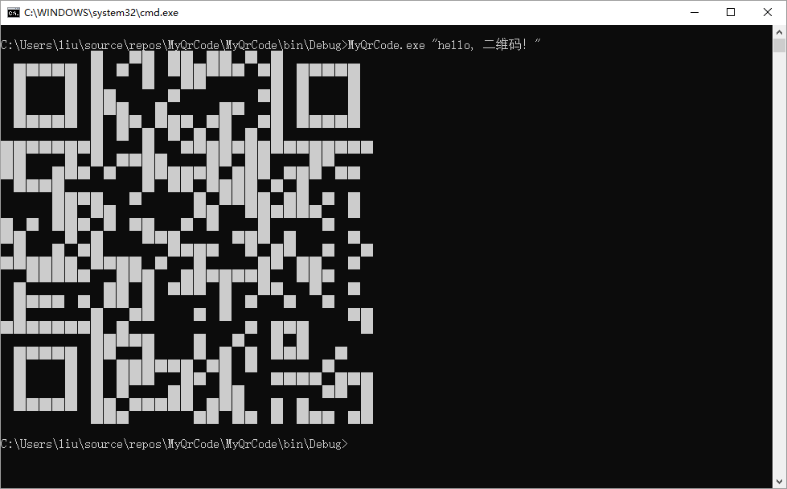
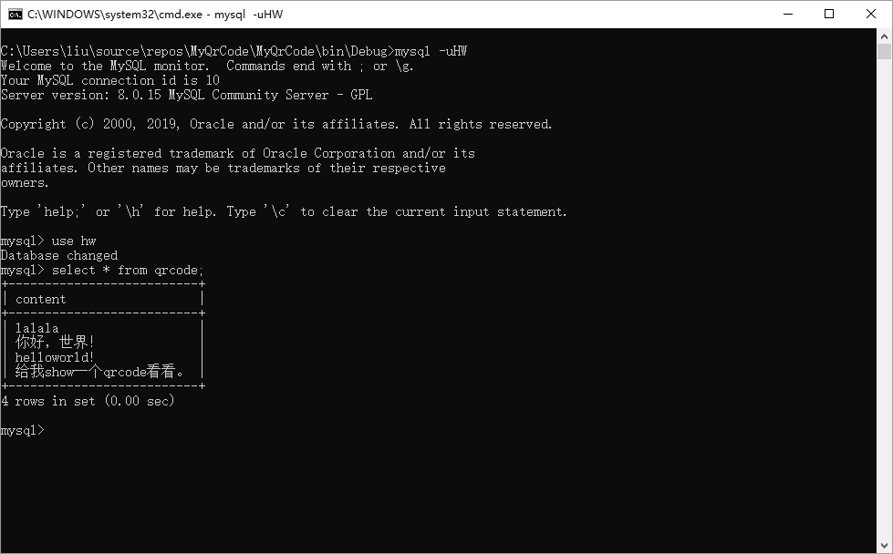
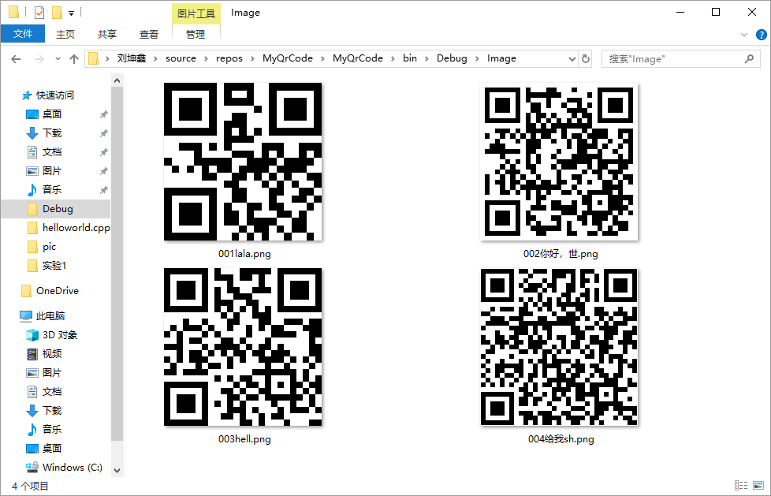
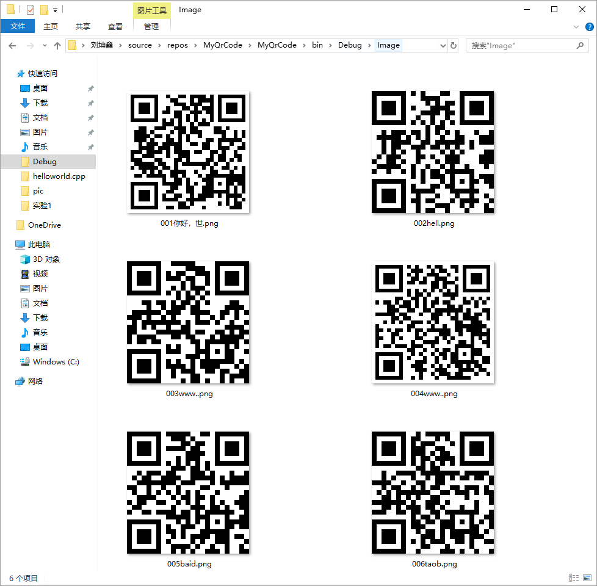

This is an easy-to-use qrcode generator.

这是一款简单易用的二维码生成器。

<!-- TOC -->autoauto- [实验1](#实验1)auto    - [1.1 功能概述](#11-功能概述)auto    - [1.2 项目特色](#12-项目特色)auto    - [1.3 代码总量](#13-代码总量)auto    - [1.4 工作时间](#14-工作时间)auto    - [1.5 结论](#15-结论)auto        - [1.5.1 实验过程](#151-实验过程)auto        - [1.5.2 实验结果](#152-实验结果)autoauto<!-- /TOC -->

## 实验1

### 1.1 功能概述



- 实现了实验的所有要求。
- 更详细的功能介绍，参考[实验结果](#152-实验结果)。
- **最详细的功能介绍，都写在注释里了。**

### 1.2 项目特色

1. 工程化代码：规范命名，异常处理，权限处理，简洁的函数，必要的注，多文件编程释等等。
2. 解决了Windows下txt记事本文件编码乱码问题，可以识别 ```gbk``` ，```utf8``` ，```utf8带BOM``` 三种编码格式的txt文件。

### 1.3 代码总量

| 文件名 | 代码量 |
| :--- | ---: |
| EncodingType.cs | 105 |
| QrCodeSolution.cs | 244 |
| MyQrCode.cs | 50 |
| total | 399 |
| readme | 100+ |

### 1.4 工作时间

三天:angry:

### 1.5 结论

#### 1.5.1 实验过程

整个实验过程中可谓一波三折，疲惫时感觉心力交瘁，完成时感觉意犹未尽。整个实验过程可以归结为百度谷歌不断学习不断DEBUG的过程。

以下稍微例举一下遇到的困难：

1. 将二维码打印到黑窗口中由于字符不对手机不能识别。
2. 保存二维码时候因为没有添加对应的引用一直找不到命名空间。
3. 读取txt文件中文乱码。
4. 读取excel文件时不能读取相对路径。
4. 尝试根据文件二进制信息识别文件类型，不过放弃了，因为网上代码不一致。
5. 数据库操作都是现学现卖。。

由于时间关系和一些原因，一些其他的拓展并没有实现：

1. -o 参数，指定保存路径并且可以定制化文件命名格式。还有行号显示不应该只是固定的三位数，应该根据合法的文本数量自动变化。
2. 二维码内嵌图片，本程序旨在打造**一款简单易用的二维码生成器**，所以就不考虑了。。
3. excel和mysql指定读取哪些内容，理由如上，不考虑了。
4. --delimiter，用户可以指定文本的界定符。

#### 1.5.2 实验结果

用户仅输入

```
> MyQrCode
```

显示使用说明：


用户输入文本：

```
> MyQrCode CONTENT
```

显示由CONTENT生成的二维码到命令行中：



先在本地数据库中设置新用户 ```HW``` ，密码为空，创建数据库 ```hw``` ，创建表格 ```qecode``` ，在 ```content``` 列中插入要生成二维码的文本内容：



用户输入：

```
> MyQrCode -s
```

将从数据库中读入的文本内容生成二维码并保存到 ```Image``` 路径下：



注意，考虑到**本程序的目的只是一款简单易用的二维码生成器**，读取数据库只能在上述指定的用户、密码、数据库、表格、列中读取。

如果用户需要读取指定的数据库，在源码中的mysql连接指令中修改即可。

在程序所在路径下创建 ```Windows``` 文本文件 ```sample.txt``` 写入内容：


用户键入：

```
> MyQrCode -f sample.txt
```

程序将逐行读取文本文件中文本内容，将生成的二维码依次保存到 ```Image``` 目录下，并且命名格式为三位数的行号+文本信息前四位字符：



读取excel文件与读取文本文件类似：

```
> MyQrCode -f sample.xlsx
```

结果如上图。